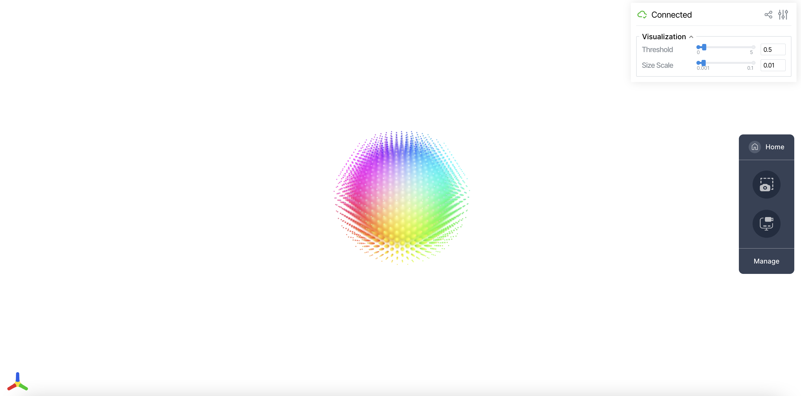
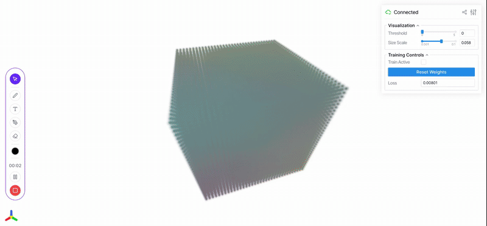
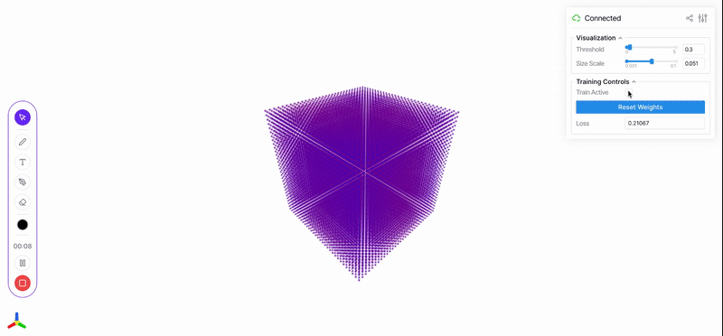

# Implicit Neural Representations
This is an implicit representation of a colorful sphere

Basically, I was going to implement NeRFs, but then I had the thought of 

"NeRF is just a clever way of viewing a neural network that fit itself to a scene, but what if we view other neural networks in the same way?"

It turned out to be a slightly cool idea, but of questionable utility. The biggest problem is that NeRFs gives us a way to view 5D --> 4D continuous functions, and most neural networks don't fit in those constraints. However, I tried it out, and I maybe I could fit more networks with some dimension reduction in the future.

This is a neural network learning the shape of a torus, which I think is cool

This one is a neural network learning housing prices in California.

This highlights the main problem of this approach. The network was trained on many different features, but the only inputs shown are Lat and Long, and median income (as x,y, and z), and the output (price) is shown as sphere size and color (blue -> red). However, you can still see how the price is concentrated in the top right corner, indicating a region preference (along with an obvious correlation with income).

To try this out, simply run
`python run.py housing`
Replace "housing" with "torus" or "nerf" for the other ones